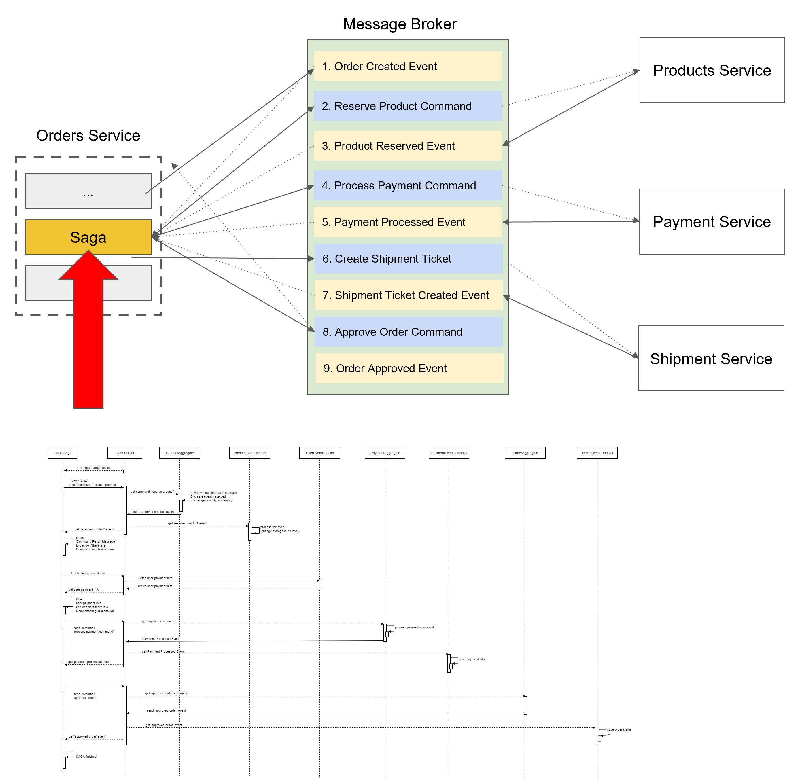
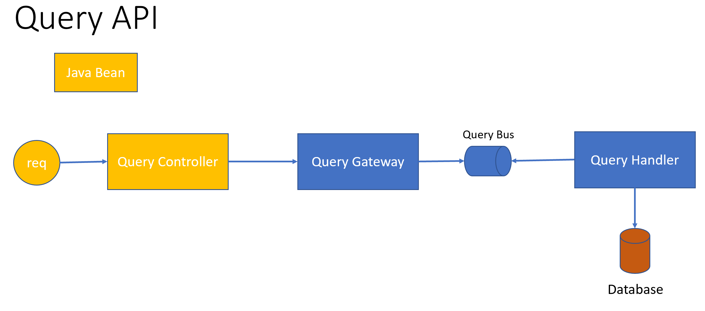
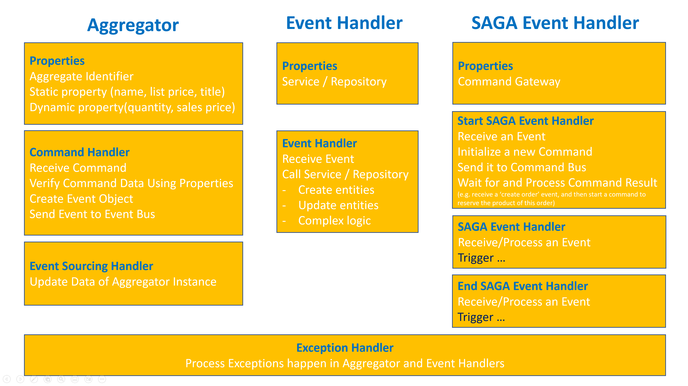

Use Springboot, Axon to build event-driven microservices, which are related the concepts CQRS SAGA and Transactions.

How to run:

1. run axon server in Docker

   *docker run --name axonserver -p 8024:8024 -p 8124:8124 -v /c/docker_data/axon/data:/data -v /c/docker_data/axon/eventdata:/eventdata -v /c/docker_data/axon/config:/config axoniq/axonserver*
2. run postgres db in Docker

   *docker run --name db-postgres -p 5433:5432 -v "/d/docker_data/db-postgres-data:/var/lib/postgresql/data" -e POSTGRES_PASSWORD=password -d postgres:alpine*
3. login to the postgrest container and create 3 databases product, orders and payments

   *docker ps*

   *docker exec -it xxxxx bash*

   *psql -U postgres*

   *create database product;*

   *create database orders;*

   *create database payments;*
4. open the project using IntelliJ
5. start the service one by one

   - *DiscoveryService*
   - *ProductService*
   - *OrderService*
   - *UserService*
   - *PaymentService*
6. import the Postman test script in folder 'testscript'
7. test

   - *run 'createProd' to create a product, and copy the productId*
   - *run 'createOrder' using the created product to create order*

**Order Create Sequence:**

**Command API:**

**Query API:**

**Aggregate & EventHandler & SAGA:**

